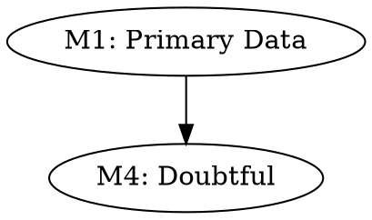

# Grilo Falante Skill — Documentação Completa

## 1. VISÃO DO PROJETO

### 1.1 Para Que Sirve (Versão Simples)

O Grilo Falante é como um amigo que nunca aceita uma ideia sem perguntar: *"De onde sabes isso? Tens provas?"*

Esse amigo é o Grilo Falante — um sistema de governação cognitiva assistida.

---

### 1.2 Sistema Integrado

O Grilo Falante agora inclui três sistemas principais:

| Sistema | Função |
|---------|-------|
| **Extração + GMIF** | Extrai conceitos e classifica por confiança |
| **Ir à Escola** | Quando não sabe, vai procurar fontes |
| **Scientific Compiler** | Analisa artigos científicos |

---

## 2. ARQUITETURA

```
┌─────────────────────────────────────────────────────────────────────────┐
│              GRILO FALANTE SKILL v2.0               │
├─────────────────────────────────────────────────────────────────┤
│                                                    │
│  INPUT                                                 │
│    │                                                  │
│    ▼                                                  │
│  ┌──────────────────┐     ┌──────────────────┐      │
│  │ Extração     │     │ Ir à Escola    │      │
│  │ (graphify)  │     │ (procura)     │      │
│  └──────────────┘     └──────────────┘      │
│    │                          │               │
│    ▼                          ▼               │
│  ┌──────────────────────────────────┐      │
│  │     GMIF Classification (M1-M7)   │      │
│  └──────────────────────────────────┘      │
│    │                                                  │
│    ▼                                                  │
│  ┌──────────────────────────────────┐      │
│  │     Scientific Compiler           │      │
│  │     (12 stages)                 │      │
│  └──────────────────────────────────┘      │
│    │                                                  │
│    ▼                                                  │
│  OUTPUT: GF-IDs + MemPalace + DOT Graph          │
│                                                    │
└─────────────────────────────────────────────────┘
```

---

## 3. INSTALAÇÃO

### 3.1 Dependências

```bash
# Necessárias
pip install graphifyy
pip install mempalace

# API (opcional)
pip install fastapi uvicorn
```

### 3.2 Sem dependências

O sistema funciona sem elas — usa fallback JSON.

---

## 4. USO

### 4.1 Ir à Escola (qualquer conversa)

```bash
python3 -m app.services.ir_a_escola
# ou
python3 -c "from app.services.ir_a_escola import IrAEscolaOrchestrator; print(IrAEscolaOrchestrator().run('Alan Turing nasceu em 1912').feynman_child)"
```

### 4.2 Scientific Compiler (artigos)

```bash
python3 -m app.services.scientific_compiler /path/to/article.md
```

### 4.3 Pipeline completo

```python
from app.services.scientific_compiler import ScientificCompiler
from app.services.ir_a_escola import IrAEscolaOrchestrator

# 1. Analisa artigo
compiler = ScientificCompiler()
result = compiler.compile('article.md')

# 2. Se há gaps, preenche
for claim in result['claim_registry']:
    escola = IrAEscolaOrchestrator()
    r = escola.run(claim['text'])
    print(f"GF-ID: {r.gf_id}")
```

### 4.4 API

```bash
# Start
python3 api.py

# Endpoints
POST /ir-a-escola           # Loop de aprendizagem
POST /scientific-compiler   # Compila artigos
POST /analyze            # Extrai conceitos
POST /search            # Pesquisa memórias
GET /status            # Estado
```

---

## 5. GMIF — Sistema de Classificação

### 5.1 Tipos

| Type | Cor | Significado |
|------|-----|-----------|
| M1 | Verde | Muitas provas (úsável) |
| M2 | Amarelo | Com suposições |
| M3 | Laranja | Sem provas |
| M4 | Vermelho | Contradições (NÃO usar) |
| M5 | Verde claro | Uma prova clara |
| M6 | Azul | Derivado |
| M7 | Roxo | Síntese |

### 5.2 GF-ID

`GF-{YYMMDD}-{TYPE}-{HASH}`

Exemplo: `GF-260413-ESCOLA-Alan T`

---

## 6. IR À ESCOLA

### 6.1 Conceito

Quando o Grilo Falante não sabe algo:
1. **Deteta gaps** (factos desconhecidos)
2. **Procura** (MemPalace → docs → web)
3. **Sintetiza** (Feynman: criança + especialista)
4. **Pergunta** ("porquê?" até entender)
5. **Guarda** (GF-ID + MemPalace)

### 6.2 Componentes

| Ficheiro | Função |
|---------|-------|
| `gap_detector.py` | Deteta factos unknown |
| `active_search.py` | Procura em 3 fontes |
| `feynman_synthesize.py` | Síntese dual |
| `why_loop.py` | Loop de "porquês?" |
| `ir_a_escola.py` | Orquestrador |

---

## 7. SCIENTIFIC COMPILER

### 7.1 12 Stages

| Stage | Função |
|-------|--------|
| 1 | GF Initialization |
| 2 | Article Ingestion |
| 3 | Citation Verification |
| 4 | Shadow Document Acquisition |
| 5 | Claim Extraction |
| 6 | Evidence Extraction |
| 7 | GMIF Classification |
| 8 | Graph Construction |
| 9 | Graph Lint (L1-L8) |
| 10 | Critical Path Computation |
| 11 | Fragility Analysis |
| 12 | Compilation Report |

### 7.2 GMIF Graph (DOT)



---

## 8. TESTES

### 8.1 Teste Unitário

```bash
cd /home/rodolfo/src/grilo-falante-skill
python3 -m app.services.ir_a_escola
```

### 8.2 Teste Artigo

```bash
python3 -m app.services.scientific_compiler test_article.md
```

Esperado:
- Claims extraídas
- Evidence detectada
- GMIF graph gerado
- Lint errors (se houver)

---

## 9. Ficheiros do Projeto

```
grilo-falante-skill/
├── README.md                    # Este ficheiro
├── api.py                    # FastAPI endpoints
├── grilo_pipeline.py         # Pipeline original
├── test_article.md           # Artigo de teste
├── app/
│   └── services/
│       ├── gap_detector.py           # Detetor de gaps
│       ├── active_search.py        # Procura ativa
│       ├── feeynman_synthesize.py # Síntese Feynman
│       ├── why_loop.py           # Loop de porquês
│       ├── ir_a_escola.py        # Orquestrador
│       └── scientific_compiler.py  # 12 stages
├── docs/
│   ├── IR_A_ESCOLA_CONCEITO.md
│   ├── gf_scientific_compiler_v_2_spec.md
│   ├── ANALISE_HOSTIL_IR_A_ESCOLA.md
│   ├── ANALISE_HOSTIL_SC_V2.md
│   └── INTEGRACAO_COMPLETA.md
└── graphify-out/            # Outputs
    └── ir_a_escola_*.json
```

---

## 10. CHANGELOG

| Data | Versão | Mudança |
|------|--------|---------|
| 2026-04-12 | 1.0.0 | Extração + GMIF |
| 2026-04-13 | 2.0.0 | Ir à Escola + Scientific Compiler |

---

## 11. LICENÇA

MIT — Rodolfo