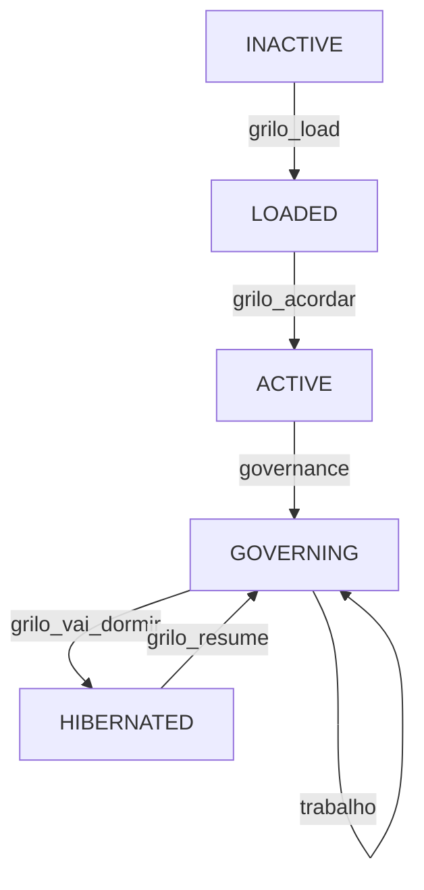
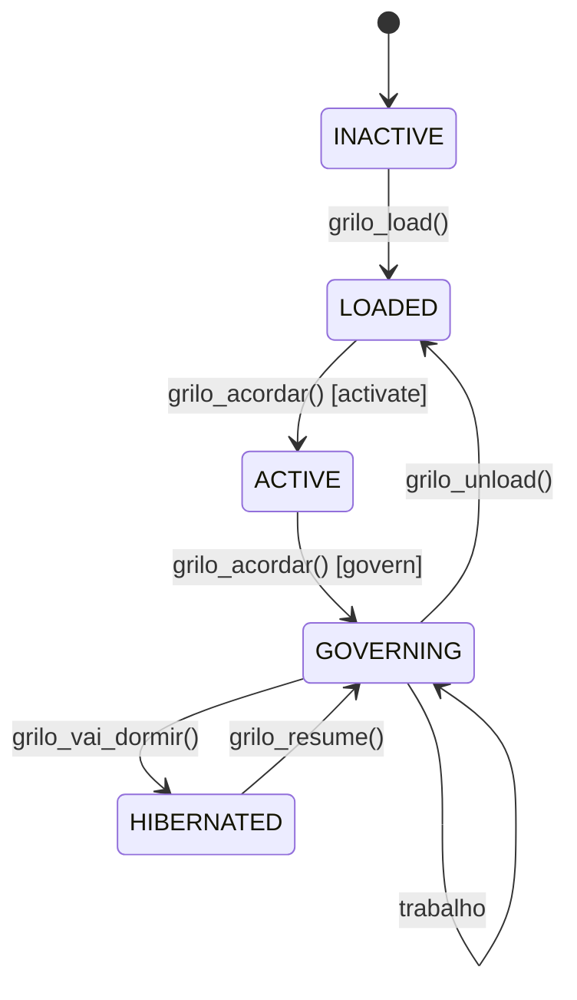

# ANÁLISE HOSTIL — Grilo Falante v3.0

**Data:** 2026-04-16
**Analista:** AI (hostile review)
**Versão Documento:** 1.0

---

## SUMÁRIO EXECUTIVO

Sistema com documentação extensa (1000+ linhas no `A_FAZER_MEMORIA_INSULAR.md`, 32 ficheiros de manual, múltiplos docs de análise) que Claims implementar um sofisticado sistema de governação epistémica com metáforas lago/ilha/pedra, ciclos dormir/acordar, e "ir à escola". **Porém, a análise ao código revela lacunas significativas entre documentação e implementação.**

---

# PARTE I — PROBLEMAS CRÍTICOS

## 1. "Ir à Escola" — Entra Mas Não Sai

### 1.1 Duas Implementações Diferentes

**Problema:** A documentação descreve UM conceito "Ir à Escola", mas existem DUAS implementações completamente diferentes:

| Ficheiro | Linhas | Descrição |
|----------|--------|-----------|
| `app/services/ir_a_escola.py` | 232 | Orchestrator com `GapDetector`, `ActiveSearcher`, `FeynmanSynthesizer` |
| `grilo_falante/backend/services/school.py` | 466 | `SchoolModeService` com 8 steps, APIs arXiv/OpenAlex |

**Nenhuma documentação explica qual é canónica ou como se relacionam.**

### 1.2 Sem "Sair da Escola"

**A metáfora:** Alguém vai para a escola aprender.

**O problema:** Não existe `sair_da_escola()`, `leave_school()`, ou qualquer função de saída.

```python
# Código existente:
async def executar_ir_a_escola(self):
    # Entra
    ...
    # NÃO HÁ SAÍDA
```

**Resultado:** O utilizador fica "preso" no modo escola para sempre. O workflow começa mas não tem condição de terminação definida para voltar ao modo normal.

---

## 2. Máquina de Estados — Inconsistências

### 2.1 SKILL.md Mostra Diagrama Errado

**Documentação (SKILL.md):**
```
INACTIVE ──grilo_load()──> LOADED ──grilo_acordar()──> GOVERNING
```

**Código (`state.py`):**
```python
CycleState.INACTIVE: [CycleState.LOADED]
CycleState.LOADED: [CycleState.ACTIVE, CycleState.INACTIVE]  # ACTIVE existe!
CycleState.ACTIVE: [CycleState.GOVERNING, CycleState.LOADED]  # Código espera ACTIVE
```

**Problema:** O código inclui um estado `ACTIVE` que a documentação ignora completamente.

### 2.2 ChatShell.start() Salta Estado ACTIVE

```python
# ChatShell.start() linha 122:
if acordar_result.success:
    self.state = "GOVERNING"  # Salta ACTIVE!
```

**O código vai:** `LOADED → ACTIVE → GOVERNING`
**Mas o ChatShell define:** `GOVERNING` diretamente

### 2.3 vai_dormir() Não Faz Dormir

**Documentação (`A_FAZER_MEMORIA_INSULAR.md`):**
```
IR_DORMIR():
  1. COLETAR interações
  2. IDENTIFICAR pedras
  3. AVALIAR transformação em ilhas
  4. AGREGAR em centros de gravidade
  5. ATUALIZAR estado das Ilhas
  6. CONSOLIDAR memória
  7. GUARDAR em memória persistente
  8. GERAR relatório de sono
```

**Código (`acordar.py`):**
```python
def vai_dormir(self) -> dict:
    """VAI_DORMIR - Hibernate the regime."""
    if not self.state_machine.hibernate():
        return {"success": False}
    # SÓ FAZ TRANSIÇÃO DE ESTADO! PasSos 1-8 NUNCA são executados!
    return {"success": True}
```

**PasSos 6 e 7** em `dormir.py` são literalmente só logs:
```python
# Passo 6: Consolidar memória
relatório["passos_executados"].append("CONSOLIDAR")  # Só append!

# Passo 7: Guardar
relatório["passos_executados"].append("GUARDAR")  # Só append!
```

---

## 3. Comandos CLI Não Correspondem à Documentação

### 3.1 SKILL.md Mostra Comandos Que Não Existen

| Documentação | Realidade |
|--------------|-----------|
| `grilo_load` | Não existe como CLI |
| `grilo_unload` | Não existe como CLI |
| `grilo_acordar` | Existe como `acordar` (nome diferente!) |
| `grilo_vai_dormir` | Existe como `dormir` (nome diferente!) |
| `grilo_resume` | Não existe |

### 3.2 Comandos de Chat Não Documentados

**Código (`grilo_falante_skill.py`):**
```python
# Chat shell aceita:
":ilhas"    # Não documentado
":dormir"   # Não documentado
":acordar"  # Não documentado
```

**Documentação (`06_chat_gobernado.md`):**
```
:quit, :exit    Sair
:save           Guardar sessão
:export         Exportar script de resume
:status         Ver estado
```

**Falta:** `:ilhas`, `:dormir`, `:acordar`

---

# PARTE II — PROBLEMAS DE IMPLEMENTAÇÃO

## 4. Governance Gate É Mínimo

### 4.1 Só Verifica 3 Palavras

```python
def _check_governance(self, claims: List[Dict]) -> List[str]:
    blocked = []
    for claim in claims:
        text = claim.get("text", "").lower()
        if any(word in text for word in ["obviamente", "claramente", "é óbvio"]):
            blocked.append(...)
    return blocked
```

**Problema:** O governance gate **SÓ** verifica这三个 palavras em português. Não há:
- Validação epistémica real
- Protocolo PINA
- Auditoria hostil
- Verificação de fontes

### 4.2 PINA Existe Mas Não Está Integrado

**Ficheiro `grilo_falante/regime/pina.py` existe com:**
- Classe `PINAProtocol`
- Enum `PINADecision` (A=incorporar, B=rejeitar, C=adiar)

**Mas não há código que ligue o PINA ao fluxo de chat.**

---

## 5. GMIF — Framework Académico Não Implementado

### 5.1 GMIF É heuristics de 3 Linhas

```python
def _determine_message_gmif(self, gmif_summary: Dict[str, int]) -> str:
    if "fact" in gmif_summary:
        return "M5"
    if "claim" in gmif_summary:
        return "M3"
    return "M3"
```

### 5.2 Framework Académico (426 linhas) Não Está Ligado

**`GMIF_Framework.md`** descreve:
- Complete Evidence
- Conditioned Evidence
- Weak Evidence
- Doubtful Evidence
- Pipeline de inferência de 7 fases
- Modelo probabilístico intervalar

**Realidade:** O código só usa M1-M7 como labels simples.

---

## 6. Estados de Legitimidade Não São Aplicados

### 6.1 Legitimidade Suspensa Por Defeito

```python
class LegitimacyState(Enum):
    SUSPENDED = "LEGITIMACY_SUSPENDED"
    ASSERTED = "LEGITIMACY_ASSERTED"
```

**Documentação:** "Por defeito: SUSPENDED. ASSERTED requer declaração humana explícita."

**Realidade:** Os valores enum existem mas:
- Nenhum código define `legitimacy_declared = True` exceto em testes
- Não há comando para utilizador declarar legitimidade

---

# PARTE III — PROBLEMAS DE UX/FLUXO

## 7. Fluxo de Ações Sem Saída

### 7.1 Lista de Ações Que Começam Mas Não Acabam

| Ação | Início | Fim | Estado |
|------|--------|-----|--------|
| `ir_a_escola` | ✅ Existe | ❌ Não existe | **Preso** |
| `acordar` | ✅ Existe | ⚠️ Parcial (`vai_dormir` não faz dormir) | Incompleto |
| `vai_dormir` | ✅ Existe | ❌ Só transição, não faz ciclo | Inútil |
| Chat shell | ✅ Existe | ⚠️ `:quit` sai, mas não faz `vai_dormir` | ⚠️ |

### 7.2 Ciclo Dormir/Acordar Partially Implemented



**Problema:** `grilo_vai_dormir` no diagrama não existe como comando. Existe `dormir` mas não faz o ciclo de dormir (só transição).

---

## 8. Três Formatos de Sessão

| Formato | Local | Conteúdo |
|---------|-------|----------|
| JSON | `sessions/{id}.json` | ChatShell messages |
| Bash script | `export_session()` | `GRILO_SESSION_ID`, `GRILO_CYCLE_ID` |
| JSON string | `--import-json` | Embeded in env var |

**Problema:** Não há validação que sessão importada funciona com estado atual do regime.

---

# PARTE IV — INCONSISTÊNCIAS DOCUMENTAIS

## 9. A_FAZER_MARKED Como "Draft" Mas Claims "IMPLEMENTED"

### 9.1 Estado do Documento

```markdown
**Estatuto:** Draft para validação  # Linha 1076

Mas:
## Fase 0: Fundamentos ✅ IMPLEMENTADO
## Fase 1: Ciclo Dormir/Acordar ✅ IMPLEMENTADO
...
```

** Contradição:** Se é draft, não pode estar todo implementado e verified.

## 10. Referências a Ficheiros Externos

```markdown
信息来源:
- `/home/rodolfo/Desktop/Artigos/vamospartiraloiçatoda/new/memo_anchor_...`
- `/home/rodolfo/Desktop/Artigos/documento_modelo_cognitivo_comparativo.md`
```

**Problema:** Se esses ficheiros forem movidos, a documentação referencia caminhos inválidos.

---

## 11. Duas Implementações GMIF

| Ficheiro | Uso |
|----------|-----|
| `app/data/memory/graph/gmif.py` | Pipeline de claims |
| `grilo_falante/backend/services/gmif.py` | Serviço standalone |

**Documentação:** Não explica qual é canónica ou como se relacionam.

---

# PARTE V — RESUMO DE ISSUES

| # | Issue | Severidade | Categoria |
|---|-------|------------|-----------|
| 1 | "Ir à escola" sem saída | **CRÍTICO** | UX/Flow |
| 2 | duas implementações "Ir à Escola" | **CRÍTICO** | Arquitetura |
| 3 | Estado ACTIVE no código mas não no diagrama | **CRÍTICO** | Documentação |
| 4 | `vai_dormir()` não faz ciclo dormir | **CRÍTICO** | Implementação |
| 5 | CLI comandos não correspondem | **CRÍTICO** | Documentação |
| 6 | Governance gate só verifica 3 palavras | **CRÍTICO** | Segurança |
| 7 | PINA existe mas não integrado | **ALTO** | Arquitetura |
| 8 | GMIF é heuristics, não framework | **ALTO** | Implementação |
| 9 | Legitimidade não é aplicada | **ALTO** | Governance |
| 10 | Comandos chat não documentados | **MÉDIO** | Documentação |
| 11 | 3 formatos de sessão | **MÉDIO** | Complexidade |
| 12 | Referências a caminhos externos | **MÉDIO** | Documentação |
| 13 | GMIF dual implementation | **MÉDIO** | Arquitetura |
| 14 | A_FAZER"Draft" vs "IMPLEMENTED" | **MÉDIO** | Documentação |

---

# PARTE VI — ANÁLISE FEYNMAN

## Explicação Simplificada

Imagine que o Grilo Falante é um **professor** que ajuda pessoas a aprender.

### O Problema

1. **"Ir à Escola"** é como um aluno entrar na sala de aula. Mas uma vez lá dentro, **não há porta de saída**. O aluno fica lá para sempre.

2. **"Dormir"** devia ser como o aluno ir para casa dormir, processar o que aprendeu, e acordar pronto para um novo dia. Mas o código atual **não faz nada disto** — só muda uma placa de "Aberto" para "Fechado".

3. **"Governance"** devia ser como um professor que verifica se o aluno entende o que está a aprender. Mas o código atual **só verifica se o aluno disse "obviamente"** três vezes.

### O Que Faltou

- **Porta de saída** da escola
- **Processo de dormir** (organizar materiais, guardar na memória)
- **Verificação real** de compreensão

### Metáforas Quebradas

| Metafora | O que devia ser | O que é |
|----------|------------------|---------|
| Lago | Memória vasta e profunda | Só vector DB |
| Pedra | Interação que cria saliência | Só um timestamp |
| Ilha | Território consolidado | Não existe aggregation |
| Escola | Lugar temporário para aprender | **永久 (permanente)** — sem saída |

---

# PARTE VII — PROPOSTAS DE CORREÇÃO

## Correção 1: Adicionar "Sair da Escola"

```python
async def sair_da_escola(self) -> dict:
    """
    Sair do modo escola e voltar ao modo normal.

    Returns:
        Resultado com novo estado e resumo do estudo
    """
    if self.estado != "EM_ESCOLA":
        return {"success": False, "error": "Not in school mode"}

    # 1. Agregar o que foi aprendido
    await self._agregar_aprendizado()

    # 2. Atualizar estado das ilhas relacionadas
    await self._actualizar_ilhas_estudo()

    # 3. Guardar sessão de estudo
    await self._guardar_sessao_estudo()

    # 4. Transição de volta
    self.estado = "GOVERNING"

    return {
        "success": True,
        "estado": self.estado,
        "resumo": self._gerar_resumo_estudo(),
    }
```

## Correção 2: Implementar Ciclo Dormir Completo

```python
async def vai_dormir(self) -> dict:
    """
    VAI_DORMIR - Ciclo completo de processamento noturno.

    1. Coletar interações do dia
    2. Identificar pedras (saliências)
    3. Agregar em torno de centros de gravidade
    4. Atualizar estado das ilhas
    5. Guardar em memória persistente
    6. Gerar relatório
    """
    if not self.state_machine.can_hibernate():
        return {"success": False, "error": "Cannot hibernate from current state"}

    # Coletar
    interações = self._coletar_interações_do_dia()

    # Identificar pedras
    pedras = await self._identificar_pedras(interações)

    # Agregar
    agregações = await self._agregar_em_ilhas(pedras)

    # Atualizar ilhas existentes (decay)
    await self._aplicar_decay_ilhas()

    # Guardar
    await self._guardar_estado_persistent()

    # Relatório
    relatório = self._gerar_relatório_sono(
        pedras=len(pedras),
        agregações=agregações,
        ilhas_atualizadas=len(self.ilhas),
    )

    # Transição
    self.state_machine.hibernate()

    return {"success": True, "relatório": relatório}
```

## Correção 3: Fix State Machine Docs



## Correção 4: CLI Comandos Corretos

| Documentação | Código |
|--------------|--------|
| `grilo load` | `grilo load` |
| `grilo unload` | `grilo unload` |
| `grilo acordar` | `grilo acordar` |
| `grilo dormir` | `grilo dormir` |
| `grilo resume` | `grilo resume` |
| `grilo ilhas` | `grilo ilhas` |
| `grilo sair` | `grilo sair` (NOVO) |

## Correção 5: Governance Gate Real

```python
def _check_governance(self, claims: List[Dict]) -> List[Dict]:
    """
    Governance gate completo.

    Verifica:
    1. Claim tem fonte?
    2. Fonte é autoritativa?
    3. Claim não contradiz Claim validada?
    4. Claim tem nível GMIF adequado?
    """
    blocked = []

    for claim in claims:
        issues = []

        # 1. Verificar fonte
        if not claim.get("source"):
            issues.append("sem fonte")

        # 2. Verificar tipo (M5+ requer fonte)
        if claim.get("gmif_level", "M3") in ["M5", "M6", "M7"]:
            if not claim.get("source"):
                issues.append(f"nível {claim['gmif_level']} requer fonte")

        # 3. Verificar contradições
        if self._contradiz_claim_validada(claim):
            issues.append("contradiz claim validada")

        if issues:
            blocked.append({
                "claim_id": claim.get("id"),
                "text": claim.get("text", "")[:50],
                "issues": issues,
            })

    return blocked
```

---

# PARTE VIII — PLANO DE AÇÃO

## Prioridade 1 (Crítico — Corrigir Agora)

- [ ] Adicionar `sair_da_escola()` function
- [ ] Implementar ciclo dormir completo em `vai_dormir()`
- [ ] Corrigir SKILL.md state diagram (adicionar ACTIVE)
- [ ] Corrigir CLI comandos na documentação

## Prioridade 2 (Alto — Corrigir Soon)

- [ ] Integrar PINA no fluxo de chat
- [ ] Implementar governance gate real
- [ ] Unificar duas implementações GMIF
- [ ] Documentar comandos `:ilhas`, `:dormir`, `:acordar`

## Prioridade 3 (Médio — Melhorar)

- [ ] Marcar A_FAZER se é draft ou validado
- [ ] Copiar referências externas para o projeto
- [ ] Adicionar validação de sessão importada
- [ ] Unificar duas implementações "Ir à Escola"

---

**Fim da Análise Hostil**
