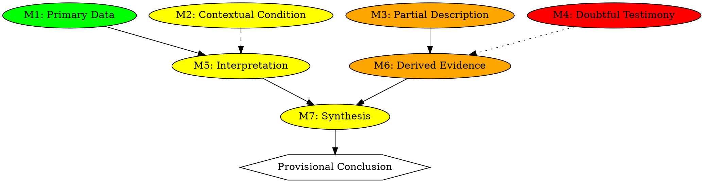

# Grilo Falante Scientific Compiler — Version 2 (GMIF‑Integrated)

## Purpose

Version 2 of the **Grilo Falante Scientific Compiler** defines a reproducible, auditable method for analysing any academic article as a structured epistemic system.

The compiler integrates:

• Grilo Falante epistemic governance
• GMIF encoded epistemic graphs
• graph lint / epistemic debugging
• shadow‑document evidence corpus

The objective is to **minimise inference and prevent unsupported claims** by forcing every conclusion to be traceable to explicit evidence.

---

# Conceptual Model

A scientific paper is treated as a **structured reasoning system** composed of:

Evidence → Interpretations → Derived reasoning → Synthesis → Conclusions

The compiler converts this reasoning structure into a **GMIF‑encoded epistemic graph**.

---

# High‑Level Execution Pipeline

```
Load GriloFalante Kernel
↓
Load Scientific Compiler
↓
Load Target Article
↓
Reference Verification
↓
Shadow Document Acquisition
↓
Claim Extraction
↓
Evidence Extraction
↓
GMIF Evidence Classification
↓
Epistemic Graph Construction
↓
GMIF Graph Lint
↓
Critical Path Analysis
↓
Fragility Analysis
↓
Compilation Report
```

---

# Reference Verification

All references cited in the article are checked against the available shadow corpus.

Three cases may occur:

1. **Reference verified** — a corresponding shadow document exists.
2. **Reference missing but identifiable** — the reference exists but has not yet been uploaded.
3. **Reference unverifiable** — the reference cannot be located or validated.

The compiler MUST NOT halt compilation when a reference is missing.

Instead, the epistemic status of the reference must be recorded and propagated into the epistemic graph.

### Handling Rules

**Case 1 — Verified reference**

A shadow document exists and evidence may be classified normally.

**Case 2 — Missing but identifiable reference**

GF may request the document from the user (GF Reference Acquisition Mode), but compilation continues.

The evidence node derived from this reference must be marked as **unverified evidence**.

**Case 3 — Unverifiable reference**

The claim remains analysable but the supporting evidence is considered epistemically weak.

In the GMIF graph the node must be encoded as:

```
M4 — Doubtful Testimony
```

and therefore rendered **red** in the graph.

This allows the compiler to continue analysis while explicitly signalling epistemic uncertainty.

### Epistemic Principle

Missing references do not block compilation.

Instead they produce **weak evidence nodes** that affect the fragility analysis and critical epistemic path.

This preserves auditability while avoiding premature termination of the analysis.

---

# Shadow Documents

Each reference is converted into a structured shadow document containing:

• bibliographic metadata
• claims extracted from the reference
• citation roles
• supported concepts
• epistemic reliability notes

Shadow documents form the **evidence corpus** used by the compiler.

---

# Claim Registry

Claims extracted from the article receive identifiers.

Example structure:

| Claim ID | Section | Claim text | Claim type |
|---------|---------|-----------|------------|
| C1 | ... | ... | normative claim |
| C2 | ... | ... | empirical claim |
| C3 | ... | ... | architectural claim |

---

# Evidence Registry

Evidence items extracted from the article and shadow documents are assigned IDs.

Example:

| E1 | Primary empirical data |
| E2 | Contextual condition |
| E3 | Partial description |
| E4 | Doubtful testimony |

These evidence types correspond to GMIF evidence categories.

---

# GMIF Evidence Classification

Evidence is classified using the GMIF taxonomy.

| Category | Meaning |
| -------- | --------- |
| M1 | Primary empirical data |
| M2 | Contextual condition |
| M3 | Partial description |
| M4 | Doubtful testimony |
| M5 | Interpretation |
| M6 | Derived evidence |
| M7 | Synthesis |

---

# GMIF Epistemic Graph

The reasoning structure is represented using GraphViz DOT.

## Canonical Graph Structure



---

# Graph Encoding Rules

## Node Colors

| Color | Meaning |
|-------|---------|
| Green | primary evidence |
| Yellow | contextual information |
| Orange | partial / derived evidence |
| Red | doubtful testimony |
| White | conclusion |

## Node Shapes

| Shape | Meaning |
|-------|---------|
| Rectangle | evidence |
| Ellipse | interpretation or synthesis |
| Hexagon | conclusion |

## Edge Styles

| Style | Meaning |
|-------|---------|
| Solid | direct support |
| Dashed | contextual support |
| Dotted | weak support |

---

# Claim‑Graph Mapping

Every claim in the claim registry must correspond to at least one graph node.

Example:

| C1 → Node M7 |
| C2 → Node M5 |

This mapping ensures traceability between textual claims and graph structure.

---

# Graph Construction Algorithm

1. Extract evidence from article and shadow corpus
2. Classify evidence using GMIF taxonomy
3. Create evidence nodes
4. Create interpretation nodes
5. Create synthesis nodes
6. Link evidence → interpretation
7. Link interpretation → synthesis
8. Link synthesis → conclusions

If reasoning steps lack evidence support, create **assumption nodes**.

---

# GMIF Graph Linter

Before the graph is accepted, the linter verifies structural integrity.

## Linter Rules

| L1 | Orphan node detection |
| L2 | Evidence reachability |
| L3 | Conclusion grounding |
| L4 | Missing inferential links |
| L5 | Hallucinated edges |
| L6 | Weak evidence critical path |
| L7 | Node ID continuity |
| L8 | Assumption exposure |

---

# Critical Epistemic Path

The compiler identifies the minimal reasoning chain supporting the main conclusion.

Example:

```
E1 → R1 → R4 → R6 → R7 → C1
```

This path is used to detect fragile arguments.

---

# Fragility Analysis

The compiler analyses the graph for:

• single‑point‑of‑failure nodes
• unsupported reasoning
• weak evidence dependencies
• assumption‑dependent conclusions

---

# Compilation Report

The final output includes:

1. Claim registry
2. Evidence registry
3. Shadow document index
4. GMIF epistemic graph
5. Graph lint report
6. Critical epistemic path
7. Fragility analysis
8. Revision recommendations

---

# GF‑SC‑GMIF Protocol — Formal Method Specification

The **GF‑SC‑GMIF Protocol** defines the operational interaction between three components:

• **GF — Grilo Falante Kernel** (epistemic governance)
• **SC — Scientific Compiler** (reasoning extraction and compilation)
• **GMIF — Graphical Meta‑Information Framework** (graph encoding and verification)

Together they form a unified system for **machine‑assisted epistemic auditing** of scientific articles.

---

## Protocol Roles

### GF — Epistemic Governance Layer

GF enforces epistemic discipline during compilation.

Responsibilities:

• prevent unsupported inference
• request missing references
• require evidence traceability
• halt reasoning when evidence is insufficient

GF therefore acts as an **epistemic guardrail**.

---

### SC — Scientific Compilation Layer

The Scientific Compiler transforms an article into a structured reasoning model.

Responsibilities:

• extract claims
• extract evidence
• map citations to shadow documents
• construct the epistemic reasoning graph

SC acts as the **structural reasoning compiler**.

---

### GMIF — Graph Encoding and Validation

GMIF defines the representation and validation of the reasoning graph.

Responsibilities:

• encode nodes using epistemic categories
• encode inferential strength via edge styles
• verify graph structure through linting rules

GMIF acts as the **epistemic representation layer**.

---

# Protocol Execution Sequence

The protocol operates through deterministic stages.

| Stage | Description |
|-------|-------------|
| 1 | GF initialisation |
| 2 | Article ingestion |
| 3 | Citation verification |
| 4 | Shadow document acquisition |
| 5 | Claim extraction |
| 6 | Evidence extraction |
| 7 | GMIF classification |
| 8 | Graph construction |
| 9 | Graph lint |
| 10 | Critical path computation |
| 11 | Fragility analysis |
| 12 | Compilation report |

---

# Stage 1 — GF Initialisation

GF establishes epistemic rules:

• inference must be evidence‑grounded
• citations must correspond to shadow documents
• unsupported reasoning must be flagged

---

# Stage 2 — Article Ingestion

The compiler parses the target article.

Extracted structures:

• sections
• claims
• citations
• bibliography

---

# Stage 3 — Citation Verification

Each citation is checked against the shadow corpus.

If a citation is missing:

```
enter GF Reference Acquisition Mode
```

The protocol halts until the reference is provided.

---

# Stage 4 — Shadow Document Acquisition

References are converted into shadow documents containing:

• metadata
• claims
• conceptual contributions
• reliability notes

Shadow documents form the **evidence substrate** of the protocol.

---

# Stage 5 — Claim Extraction

Claims are extracted and assigned identifiers.

Example format:

```
C1 empirical claim
C2 normative claim
C3 architectural claim
```

---

# Stage 6 — Evidence Extraction

Evidence items supporting claims are identified.

Each evidence element receives an identifier:

```
E1
E2
E3
```

Evidence sources may include:

• primary data
• cited literature
• theoretical argument

---

# Stage 7 — GMIF Classification

Evidence and reasoning steps are classified using the GMIF taxonomy.

```
M1 primary empirical data
M2 contextual condition
M3 partial description
M4 doubtful testimony
M5 interpretation
M6 derived evidence
M7 synthesis
```

---

# Stage 8 — Epistemic Graph Construction

The reasoning structure is compiled into a GMIF graph.

Nodes represent:

• evidence
• interpretations
• derived reasoning
• synthesis
• conclusions

Edges represent inferential relationships.

---

# Stage 9 — GMIF Graph Lint

The graph is validated using the GMIF linter.

The linter checks:

• orphan nodes
• unsupported reasoning
• hallucinated edges
• broken evidence chains
• weak evidence dependencies

If errors occur, the compiler reports them before continuing.

---

# Stage 10 — Critical Path Computation

The protocol identifies the **minimal reasoning chain** linking evidence to conclusions.

---

# Stage 11 — Fragility Analysis

The analysis identifies:

• single points of failure
• missing evidence
• unverified assumptions

---

# Stage 12 — Compilation Report

The final deliverable contains all analysis components.

---

*Document Version: 2.0*
*Date: 2026-04-13*
*Integrates: Grilo Falante + GMIF + Shadow Corpus*