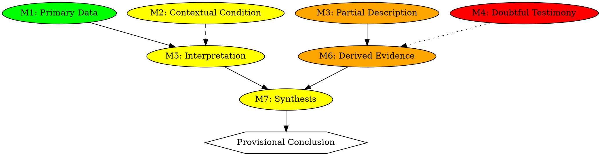

# A Graphical Meta-Information Framework
*for Evaluating Evidence and Inference under Uncertainty*

## Version for Academic Submission

---

Author: Rodolfo Matos  
Affiliation: Universidade do Porto  
Email: rodolfo@uporto.pt  
Date: 11/Dec/2025  

---

# Abstract
This article presents a unified methodological framework for analysing, structuring, and evaluating evidence under uncertainty. The model integrates four complementary components: (1) a taxonomy for classifying meta-information according to verificability and epistemic strength; (2) a graph-based representation of inferential dependencies; (3) a disciplined inference pipeline that constrains reasoning steps and exposes implicit assumptions; and (4) a qualitative Bayesian interval model that compares hypotheses through structured relations of likelihood rather than numerical estimation. The framework is grounded in foundational work in epistemology, argumentation theory, and cognitive heuristics, and is designed to enhance transparency, reproducibility, and rigour in investigative reasoning. Conceptual examples demonstrate the method’s applicability across diverse domains such as historical research, digital forensics, and information analysis.

**Keywords:** epistemology; evidential reasoning; uncertainty; argumentation theory; graph modelling; Bayesian inference; meta-information; inferential transparency.

---

# Author Note
This manuscript is part of a broader methodological project on structured epistemic reasoning and visualisation of inferential architectures. Correspondence concerning this article should be addressed to Rodolfo Matos, Universidade do Porto, rodolfo@uporto.pt.

---

# 1. Introduction
Reasoning with incomplete, ambiguous, or contradictory information remains a central challenge across scientific and humanistic disciplines. In many investigative contexts, evidential assessment is conducted implicitly, leaving key inferential steps unarticulated and vulnerable to bias. Research in cognitive science shows that humans tend to rely on heuristics that, although efficient, can obscure underlying assumptions (Gigerenzer & Gaissmaier 2011; Kahneman 2011). Similarly, epistemological studies highlight the importance of making justificatory structures explicit to reduce error and improve traceability (Toulmin 1958; Lipton 2004).

This article presents a methodological framework that formalises evidential reasoning through four interconnected components: a taxonomy of meta-information, a graph-based epistemic structure, a disciplined inference pipeline, and a qualitative-probabilistic interval model. Together, these components aim to render inferential processes transparent, modular, and verifiable. The resulting system is disciplinarily neutral and applicable in contexts where uncertainty is intrinsic rather than incidental.

---

# 2. Conceptual Framework
The methodological framework proposed in this article rests on three foundational motivations: the need to reduce ambiguity in evidential assessment, the need to externalise implicit inferential structures, and the need to support reasoning under uncertainty without overreliance on quantitative estimates. Classical work in argumentation theory emphasises that claims are never evaluated in isolation but within structured networks of evidence, warrants, and assumptions (Toulmin 1958; Walton et al. 2008). More recent developments in epistemology and the philosophy of information (Floridi 2011) reinforce the importance of explicit modelling when navigating contexts where information is fragmentary or heterogeneous.

The framework integrates these traditions by combining conceptual clarity with operational mechanisms. First, the taxonomy of meta-information provides a basis for classifying evidential units in terms of their strength and verificability. Second, the graph-based epistemic representation renders inferential dependencies visible, enabling inspection and validation. Third, the inference pipeline imposes a disciplined progression from decomposition to conclusion, minimising the propagation of unexamined assumptions. Finally, the interval probabilistic model offers a principled means of expressing uncertainty without resorting to speculative numerical assignments.

Together, these components yield a methodology that is both robust and adaptable, capable of supporting transparent reasoning across domains. The following sections develop each component in detail.

---

# 3. Taxonomy of Meta-Information
A rigorous taxonomy is essential for structuring evidential assessment. This section refines the four categories—Complete, Conditioned, Weak, and Doubtful—into a clearer analytical framework. The goal is not merely to label evidential units but to articulate principled distinctions that guide inferential weight, verifiability, and epistemic risk. The structure follows the tradition of qualitative evidential hierarchies in argumentation theory and epistemic evaluation (Toulmin 1958; Walton et al. 2008; Wagemans 2016).

## 3.1 Definition and Purpose
Meta-information refers to any evidential unit that describes, constrains, or conditions the interpretation of other information. Treating such units explicitly is crucial, as they often govern the epistemic status of downstream inferences. A well-formed meta-information unit should demonstrate:

- **Autonomy**, enabling assessment independent of the broader narrative;

- **Traceability**, ensuring its source and justification are identifiable;

- **Epistemic Functionality**, contributing meaningfully to the evaluation of a hypothesis.

By decomposing information into meta-information units, we gain finer analytical control and reduce the risk of conflating factual content with interpretative overlays.

## 3.2 Category 1 — Complete Evidence
Complete Evidence consists of units supported by verifiable, stable, and context-independent documentation. Such evidence contributes strongly to inference because its epistemic status is not contingent on auxiliary assumptions.

- **Characteristics:** high verifiability, independence from interpretative conditions, minimal semantic ambiguity.

- **Role in reasoning:** forms the structural basis of inferential chains.

- **Example:** a digitally verifiable timestamp or an authenticated archival document.

## 3.3 Category 2 — Conditioned Evidence
Conditioned Evidence remains reliable but depends on auxiliary assumptions whose validity cannot be guaranteed absolutely.

- **Characteristics:** moderate verifiability; dependence on interpretation, context, or translation.

- **Role in reasoning:** supports inferences but requires explicit acknowledgement of conditions.

- **Example:** a technical assessment whose validity relies on contextual parameters.

## 3.4 Category 3 — Weak Evidence
Weak Evidence arises from incomplete, secondary, or insufficiently corroborated sources.

- **Characteristics:** low verifiability; high susceptibility to misinterpretation; limited reliability.

- **Role in reasoning:** heuristic or exploratory; not structurally supportive.

- **Example:** an unsourced claim or non-reproducible observation.

## 3.5 Category 4 — Doubtful Evidence
Doubtful Evidence shows signs of unreliability, contradiction, or lack of provenance.

- **Characteristics:** very low verifiability; high risk of distortion; dependence on implausible assumptions.

- **Role in reasoning:** should not support inferences; often requires exclusion.

- **Example:** a claim with no identifiable source and contradictory to established records.

## 3.6 Boundary Criteria Between Categories
Boundaries between categories operate as epistemic gradients rather than rigid partitions. The classification is guided by:

- degree of dependence on auxiliary assumptions;

- robustness of provenance;

- internal coherence and external consistency;

- susceptibility to revision.

## 3.7 Integration with Verifiability and Inferential Weight
The taxonomy interfaces directly with the inference pipeline: Complete and Conditioned Evidence typically carry functional inferential weight, while Weak and Doubtful Evidence serve primarily diagnostic roles, revealing uncertainty or fragility.

## 3.8 Operational Summary

| Category | Name        | Verifiability | Dependence on Assumptions | Inferential Function      | Risk Level |
|----------|-------------|---------------|----------------------------|----------------------------|------------|
| 1        | Complete    | High          | None                       | Structural Support         | Low        |
| 2        | Conditioned | Medium        | Moderate                   | Qualified Support          | Moderate   |
| 3        | Weak        | Low           | High                       | Exploratory / Heuristic    | High       |
| 4        | Doubtful    | Very Low      | Very High                  | Excluded / Diagnostic Only | Very High  |

---

# 4. Graph-Based Epistemic Representation
Graph-based representations offer a powerful means of externalising the structure of evidential reasoning. Unlike narrative exposition—which often obscures dependencies, implicit assumptions, or logical gaps—graph structures make these relationships explicit and inspectable. This aligns with work in argumentation theory and structured knowledge representation (Diestel 2017; Walton et al. 2008; Wagemans 2016), which emphasises the value of formal diagrammatic models for evaluating inferential coherence.

## 4.1 Rationale for Graph Structures
Graphs provide a modular, scalable, and visually intelligible medium for evidential modelling. Key advantages include:

- **Structural transparency:** inferential pathways become immediately visible.

- **Dependency mapping:** nodes reveal the evidential foundation of each claim.

- **Conflict detection:** inconsistencies or circularities manifest as identifiable structural patterns.

- **Scalability:** complex bodies of evidence can be expanded without loss of clarity.

By rendering epistemic architecture visible, graphs promote interpretability and reduce the risk of overlooking critical assumptions.

## 4.2 Nodes as Epistemic Units
Each node represents a meta-information unit classified under the taxonomy introduced in Section 3. Nodes may include attributes such as category, source, stability, and epistemic risk. Precision in node definition is crucial: overly broad nodes hide assumptions, while excessively granular nodes produce unnecessary fragmentation. The objective is to capture epistemically meaningful distinctions.

## 4.3 Edges as Relations of Dependence
Edges express the inferential relationships between meta-information units. These may represent:

- **Factual dependence:** one evidential unit relies on the accuracy of another;

- **Documentary dependence:** an interpretation is grounded in a specific source;

- **Conditional dependence:** an evidential unit’s weight depends on an auxiliary assumption;

- **Inferential aggregation:** multiple nodes jointly support a higher-level claim.

Edge styles signal the strength of these relations—for example, solid lines for strong dependencies and dotted lines for weak or hypothetical ones. Differentiation of edge types aids in quickly assessing structural robustness.

## 4.4 Visual Conventions and Epistemic Signalling
To maximise interpretive clarity, consistent visual conventions are recommended:

- Colour-coding nodes by evidential category (green for Complete, yellow for Conditioned, orange for Weak, red for Doubtful).

- Using shape differentiation to distinguish evidential units (rectangles), interpretative constructs (ellipses), and provisional conclusions (hexagons).

- Applying line styles that reflect dependency strength.

## 4.5 Conceptual Example

{ width=80% }

**Figure 1.** Graph-based representation of evidential dependencies within the proposed epistemic framework.  
Nodes represent meta-information units classified according to the taxonomy defined in Section 3.  
Edges encode inferential dependencies of varying strength (solid = strong, dashed = moderate, dotted = weak or hypothetical).  
The graph illustrates how evidential fragmentation, conditional structures, and synthesis mechanisms interact within an integrated epistemic architecture.

### GraphViz Specification

## 4.6 Interpreting the Graph in Context
Graphs function not as decorative illustrations but as analytical tools. They enable the investigator to:

- identify the fragility of inference chains,

- localise nodes whose revision would significantly affect conclusions,

- distinguish structurally central from peripheral evidence,

- evaluate how much of a conclusion rests on low-quality or conditional evidence.

## 4.7 Implementation Guidance
For practical use, graph specification languages such as GraphViz are recommended. Nodes should include metadata (category, source, uncertainty indicators), and graphs should be versioned alongside the manuscript. Automated checks for cycles and disconnected components further strengthen methodological rigour.

---

# 5. Epistemic Inference Pipeline
The inference pipeline operationalises the methodological commitments articulated in earlier sections. Its purpose is to ensure that evidential reasoning proceeds in a structured, transparent, and verifiable manner. Rather than allowing conclusions to emerge from implicit cognitive shortcuts, the pipeline enforces an explicit sequence of analytical steps. This reflects insights from both epistemic regulation (Lipton 2004) and cognitive science on disciplined reasoning (Gigerenzer & Gaissmaier 2011).

## 5.1 Purpose and Structure
The pipeline consists of seven ordered phases—decomposition, classification, verification, integration, conflict analysis, synthesis, and qualified conclusion. These phases prevent premature inference and ensure that evidential weight is grounded in the taxonomy and graph structure.

## 5.2 Step Descriptions
**Decomposition:** Extracts autonomous meta-information units, isolating interpretations from facts.

**Classification:** Assigns each unit to a category in the taxonomy, establishing its epistemic weight.

**Verification:** Tests each unit for provenance, coherence, and susceptibility to misinterpretation.

**Integration:** Constructs or updates the evidential graph, embedding each unit in a transparent structural context.

**Conflict Analysis:** Identifies contradictions, fragile inferential chains, or circular dependencies.

**Synthesis:** Aggregates structurally coherent evidential pathways.

**Qualified Conclusion:** Produces a conclusion constrained by evidential strength and the interval probabilistic model.

## 5.3 Pseudocode Summary

INPUT: evidential set I
OUTPUT: qualified conclusion C

1. M = decompose(I)

2. for m in M: classify(m)

3. for m in M: verify(m)

4. G = integrate_into_graph(M)

5. resolve_conflicts(G)

6. S = synthesise(G)

7. C = conclude(S)

## 5.4 Interfacing with Other Components
The pipeline is not standalone: it relies on the taxonomy for evidential weighting, on the graph for structural representation, and on the interval model for calibrated plausibility. Its disciplinary function is to ensure that no conclusion exceeds what the available evidence can legitimately support.

---

# 6. Interval Probabilistic Model
This section refines the qualitative Bayesian framework underpinning the assessment of hypotheses under uncertainty. The goal is not numerical estimation but disciplined comparison of plausibility through structured relations of likelihood. The approach aligns with epistemic probability traditions (Jaynes 2003; Goodman 1983; Hacking 1975) while remaining compatible with contexts lacking quantifiable data.

## 6.1 Motivation
Standard probabilistic reasoning is often impractical in domains where evidence is fragmentary or mediated by interpretation. Interval-based plausibility resolves this by expressing uncertainty through ordered categories—high, medium, low—avoiding spurious precision.

## 6.2 Formal Basis

Bayes’ rule provides the conceptual structure:

P(H|E) is proportional to P(E|H) × P(H),

where the proportionality sign “is proportional to” indicates that the normalising constant P(E) is omitted.  
For comparative reasoning between hypotheses, only the relative magnitudes of P(E|H) × P(H) matter.  
The full expression is:

P(H|E) = [P(E|H) × P(H)] / P(E).

## 6.3 Likelihood Relations

- **Strong support:** P(E|H) is much greater than P(E|not H)  
- **Moderate support:** P(E|H) is greater than P(E|not H)  
- **Neutral evidence:** P(E|H) is approximately equal to P(E|not H)  
- **Counterevidence:** P(E|H) is less than P(E|not H)

## 6.4 Aggregation of Evidence
Multiple evidential units E = {E₁, …, En} update plausibility through their combined likelihood relations. Independent, structurally strong evidence shifts plausibility upward; conflicting or weak evidence tempers or counterbalances this effect.

## 6.5 Sensitivity and Dependency
The model explicitly recognises sensitivity to prior plausibility and evidential dependencies. Independence is assumed only when justified; otherwise, dependencies must be encoded in the graph and handled by the inference pipeline.

## 6.6 Conceptual Example
A hypothesis H about the authenticity of a document may be supported strongly by a verified cryptographic timestamp (strong support), moderately by contextual expert testimony (neutral to moderate), and weakened by inconsistent metadata (counterevidence). The resulting plausibility lies in a calibrated interval, neither overstated nor minimised.

## 6.7 Integration
The interval model interfaces with the taxonomy (evidential strength), graph (structural relations), and pipeline (sequencing of assessment). It provides the final quantitative discipline required for justified, proportionate conclusions.

---

# 7. Conceptual Examples
This section provides a set of domain-neutral examples that demonstrate how the methodological components—taxonomy, graph structure, inference pipeline, and interval probabilistic model—operate when applied to concrete reasoning tasks. The examples are intentionally abstract to emphasise methodological clarity rather than domain expertise.

## 7.1 Example 1: Document Authentication
**Hypothesis H:** A digital document D was created on the declared date.

### Evidential units

- **M1 (Complete):** A cryptographically verifiable timestamp.  

- **M2 (Conditioned):** An expert technical assessment, reliable but interpretative.  

- **M3 (Weak):** Easily manipulated system metadata.  

- **M4 (Doubtful):** An unverified screenshot from an unknown source.

### Inferential structure
M1 and M2 jointly support H, though with different weights. M3 and M4 introduce noise but do not undermine the strong structural support provided by M1.

### Interval assessment

- M1 strongly favours H.  

- M2 provides moderate support.  

- M3 is neutral to mildly unfavourable.  

- M4 is counterevidential but epistemically marginal.

**Conclusion:** The plausibility of H lies in the medium–high interval.

---

## 7.2 Example 2: Reconciling Divergent Testimonies
**Hypothesis H:** Event X occurred at approximately 10:00.

### Evidential units

- **T1 (Conditioned):** Witness A reports 10:00.  

- **T2 (Weak):** Witness B reports 11:00 with notable inconsistencies.  

- **T3 (Conditioned):** Witness C reports “late morning” without precision.  

- **T4 (Complete):** An automated sensor logs activity at 09:58.

### Interval assessment
T4 provides strong structural support. T1 aligns with T4. T3 is too vague to meaningfully shift plausibility. T2 adds mild counterpressure but carries low epistemic weight.

**Conclusion:** The hypothesis sits in the high–medium plausibility interval.

---

## 7.3 Example 3: Classification of an Informational Artefact
**Hypothesis H:** Artefact A is genuine.

### Evidential units

- **E1 (Complete):** Verified provenance.  

- **E2 (Conditioned):** Technical analysis dependent on laboratory conditions.  

- **E3 (Weak):** Secondary report without cited sources.  

- **E4 (Doubtful):** Anonymous online claim.

### Assessment
E1 and E2 form the structural backbone of the inference. E3 is weakly supportive. E4 does not meaningfully contribute and carries diagnostic value only.

**Conclusion:** The resulting plausibility interval is medium–high, dominated by E1.

---

# 8. Discussion
This section evaluates the methodological contribution of the proposed framework, articulating its strengths, limitations, and potential extensions. The goal is not merely to summarise but to situate the model within broader epistemological and methodological traditions, thereby clarifying its scope and relevance.

## 8.1 Strengths of the Framework
1. **Epistemic Transparency** — By externalising inferential architecture, the model reduces cognitive opacity and aligns with long-standing calls for structured justification (Toulmin 1958; Lipton 2004).

2. **Modularity and Scalability** — The framework accommodates both small and large evidential corpora without conceptual strain.

3. **Error Mitigation** — The pipeline constrains common cognitive vulnerabilities (Gigerenzer & Gaissmaier 2011), encouraging disciplined reasoning.

4. **Structured Uncertainty Management** — The interval model expresses uncertainty without numerical precision, consistent with epistemic probability theory (Hacking 1975; Jaynes 2003).

## 8.2 Limitations and Challenges
1. **Sensitivity to Decomposition** — Poor decomposition can distort evidential structure.  

2. **Cognitive Demands** — Analysts must adapt to a more rigorous workflow.  

3. **Visual Complexity** — Large graphs require filtering or decomposition.  

4. **Numerical Absence When Relevant** — Domains with rich quantitative data may require hybridisation.

## 8.3 Potential Applications

- Historical and archival analysis  

- Digital forensics  

- Investigative journalism  

- Humanities and information systems  

- Explainable AI (XAI)

## 8.4 Future Work
Future development includes empirical case studies and hybrid numerical–qualitative models.

---

# 9. Conclusion
This article has presented a unified methodological framework for evidential reasoning under uncertainty, integrating four components: a taxonomy of meta-information, a graph-based epistemic representation, a disciplined inference pipeline, and a qualitative interval-probabilistic model. Together, these components offer a structured alternative to informal reasoning practices, making dependencies explicit, exposing assumptions, and ensuring that conclusions remain proportionate to evidential strength.

Future work may include empirical validation through case studies and hybrid Bayesian extensions.

---

# 10. References

- Diestel, Reinhard. *Graph Theory*. Springer, 2017.  
- Floridi, Luciano. *The Philosophy of Information*. Oxford University Press, 2011.  
- Gigerenzer, Gerd, and Wolfgang Gaissmaier. “Heuristic Decision Making.” *Annual Review of Psychology* 62 (2011): 451–82.  
- Goodman, Nelson. *Fact, Fiction, and Forecast*. Harvard University Press, 1983.  
- Hacking, Ian. *The Emergence of Probability*. Cambridge University Press, 1975.  
- Jaynes, E. T. *Probability Theory: The Logic of Science*. Cambridge University Press, 2003.  
- Kahneman, Daniel. *Thinking, Fast and Slow*. Farrar, Straus and Giroux, 2011.  
- Lipton, Peter. *Inference to the Best Explanation*. Routledge, 2004.  
- Toulmin, Stephen. *The Uses of Argument*. Cambridge University Press, 1958.  
- Wagemans, Jean. “Constructing a Periodic Table of Arguments.” *The Argumentation Library*, Springer, 2016.  
- Walton, Douglas, Chris Reed, and Fabrizio Macagno. *Argumentation Schemes*. Cambridge University Press, 2008.

