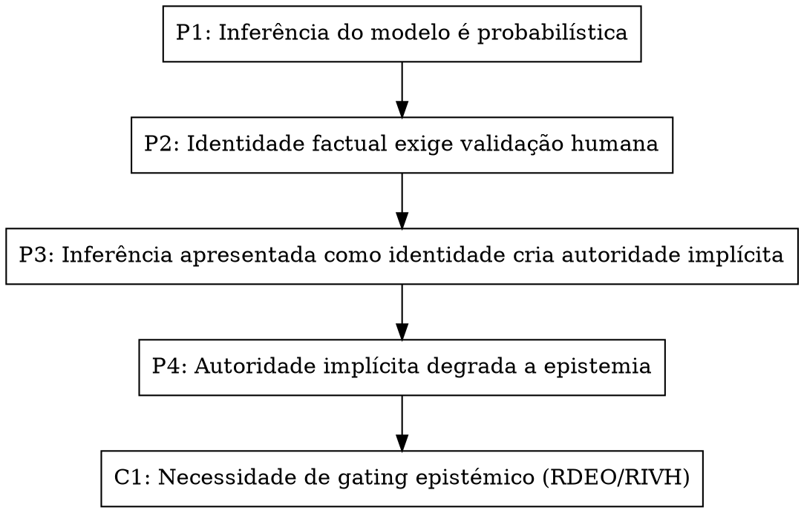

# CÁPSULA CONCEPTUAL — Auditoria por Grafo Epistémico
## Metadados Epistémicos

- **GF-ID:** GF-260415-M7-b1ed0f
- **GMIF:** M7 — Synthesis - aggregated from multiple derived claims
- **Gerado:** 2026-04-15T14:33:25Z
- **Fonte:** capsula_auditoria_grafo_epistemico.md

---

## Identificador

CAPSULA-EPI-GRAPH-AUDIT-01

## Título

Toda a Regra Deve Ser Auditável por Premissas Explicitadas em Grafo

---

## Ideia central

Qualquer afirmação normativa ou regra epistémica só é legítima se as **premissas que a sustentam forem explicitadas** e **as relações entre essas premissas forem representáveis num grafo direcional auditável**.

Sem grafo, há narrativa; com grafo, há governação.

---

## Formulação curta (núcleo)

> Nenhuma regra deve existir apenas como texto: deve poder ser reconstruída como um grafo de premissas e inferências auditáveis.

---

## Problema que a cápsula resolve

Sistemas cognitivos (humanos ou assistidos por LLMs) tendem a:

- aceitar regras porque “fazem sentido”;
- confiar em coerência retórica;
- colapsar justificação em autoridade implícita.

A ausência de representação gráfica:

- esconde dependências;
- dificulta contestação localizada;
- impede auditoria estrutural.

---

## Princípio operacional

Uma regra epistémica é válida **apenas se**:

1. As premissas forem explicitadas;
2. Cada premissa puder ser contestada isoladamente;
3. As relações forem direcionais (não associativas);
4. Não existirem ciclos de auto‑legitimação;
5. A conclusão emergir apenas da estrutura do grafo.

---

## Exemplo auditado (caso RDEO / RIVH)

### Tese

É necessário um gate epistémico que impeça o colapso de inferência em identidade factual.

### Premissas

- **P1** — A inferência do modelo é probabilística, não observacional.
- **P2** — Identidade factual exige validação humana.
- **P3** — Inferência apresentada como identidade cria autoridade implícita.
- **P4** — Autoridade implícita degrada a qualidade epistémica.

### Conclusão

- **C1** — É necessária uma regra de gating epistémico (RDEO / RIVH).

---

## Representação em grafo (Graphviz)

---

## Relação com outros artefactos

- Fundamenta **DOCUMENTO\_Regras\_Formulacao\_Epistemica.md**
- Complementa:
  - CAPSULA-EPI-ATTR-01 (RDEO)
  - CAPSULA-EPI-RIVH-01 (Validação Humana)

---

## Estatuto

- Cápsula conceptual
- Não canónica
- Elegível para integração como regra de auditoria transversal

---

## Nota crítica

Sem este tipo de cápsula, um sistema pode cumprir regras locais e ainda assim falhar **globalmente**, por ausência de visibilidade estrutural.

O grafo não é decoração: é o mecanismo de responsabilidade.

---

## Estado

Cápsula materializada explicitamente no canvas. Nenhuma promoção implícita a canónico efetuada.

