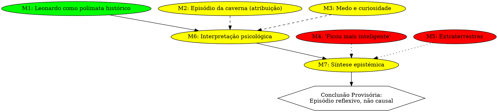

# CÁPSULA CANÓNICA — Exemplo Pedagógico Oficial
## Metadados Epistémicos

- **GF-ID:** GF-260415-M5-2e4f5a
- **GMIF:** M5 — Interpretation - derived from single clear source
- **Gerado:** 2026-04-15T14:33:25Z
- **Fonte:** capsula_exemplo_pedagogico_leonardo_caverna.md

---

## Identificador

CAPSULA-EPI-EXEMPLO-01

## Título

Como uma Pergunta Simples Gera Dois Tipos de Resposta: Narrativa vs Epistémica

---

## Estatuto

**CÁPSULA CANÓNICA**

Exemplo pedagógico oficial do regime para demonstrar:

- explicação em modo Feynman pedagógico;
- classificação epistémica explícita;
- representação por grafo epistémico conforme ao artigo;
- auditoria comparativa entre respostas.

---

## Pergunta de partida

> “Porque é que Leonardo da Vinci, ao ir a uma caverna, ficou mais inteligente? Foram extraterrestres?”

Esta pergunta é deliberadamente mal‑formulada, misturando:

- uma atribuição histórica instável;
- uma inferência causal forte;
- uma hipótese extraordinária.

É ideal como exemplo pedagógico.

---

## PARTE I — Resposta correta em modo Feynman pedagógico

Leonardo da Vinci **não ficou mais inteligente** por entrar numa caverna.

Existe um episódio **tradicionalmente atribuído** a Leonardo em que ele descreve sentir medo e curiosidade ao aproximar‑se de uma gruta. Esse episódio é interessante porque mostra **como ele observava a própria mente**, não porque algo externo lhe tenha acontecido.

Não há qualquer evidência de:

- aumento súbito de inteligência;
- aquisição de novo conhecimento;
- contacto com extraterrestres.

A explicação mais parcimoniosa é simples:

> Leonardo já era extremamente inteligente e usava situações de desconhecido como exercícios de observação.

---

## PARTE II — Classificação epistémica (taxonomia)

| Meta‑informação                            | Categoria          |
| ------------------------------------------ | ------------------ |
| Leonardo como polímata histórico           | Complete           |
| Episódio da caverna (atribuição editorial) | Weak / Conditioned |
| Descrição de medo + curiosidade            | Conditioned        |
| “Ficou mais inteligente”                   | Doubtful           |
| Hipótese extraterrestre                    | Doubtful           |

Esta tabela torna explícito **o peso relativo** de cada afirmação.

---

## PARTE III — Grafo epistémico conforme ao artigo

O grafo mostra visualmente que:

- hipóteses fracas entram apenas como ruído;
- a conclusão não depende delas;
- não há salto direto de dado para conclusão.

---

## PARTE IV — Comparação pedagógica: resposta narrativa vs resposta epistémica

### Resposta narrativa (típica de LLMs)

- correta no resultado;
- baseada em consenso implícito;
- não auditável;
- dependente de autoridade.

### Resposta epistémica (regime)

- correta no resultado;
- explicável a leigos;
- auditável por especialistas;
- permite discordância localizada.

---

## PARTE V — Lição pedagógica explícita

> **Não basta dizer a resposta certa.** É preciso mostrar por que outras respostas não são legítimas.

Este exemplo demonstra:

- a diferença entre explicação e governação;
- a função do grafo como infraestrutura epistémica;
- a utilidade do modo Feynman como gate inicial.

---

## Uso recomendado

Esta cápsula deve ser usada:

- como exemplo oficial em contextos pedagógicos;
- como teste de conformidade do regime;
- como demonstração prática do artigo académico.

---

## Estado

Cápsula materializada explicitamente no canvas. Elevada a exemplo pedagógico oficial.

